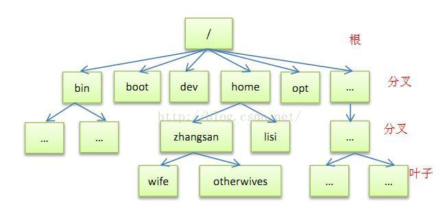

<div style="text-align: center; font-weight: 700; font-size: 2em;">linux目录结构分析</div>

# 一、常用目录简介
|目录|说明|
|---------------|:-------------:|
|bin|存放着最经常使用的命令|
|boot|这里存放的是启动Linux时使用的一些核心文件，包括一些连接文件以及镜像文件。|
|dev|dev是Device(设备)的缩写, 该目录下存放的是Linux的外部设备，在Linux中访问设备的方式和访问文件的方式是相同的。|
|etc|用来存放所有的系统管理所需要的配置文件和子目录。|
|home|用户的主目录，在Linux中，每个用户都有一个自己的目录，一般该目录名是以用户的账号命名的。|
|lib|这个目录里存放着系统最基本的动态连接共享库，其作用类似于Windows里的DLL文件，几乎所有的应用程序都需要用到这些共享库。|
|lost+found|这个目录一般情况下是空的，当系统非法关机后，这里就存放了一些文件。|
|media|linux系统会自动识别一些设备，例如U盘、光驱等等，当识别后，linux会把识别的设备挂载到这个目录下。|
|mnt|系统提供该目录是为了让用户临时挂载别的文件系统的，我们可以将光驱挂载在/mnt/上，然后进入该目录就可以查看光驱里的内容了。|
|opt| 这是给主机额外安装软件所摆放的目录。比如你安装一个ORACLE数据库则就可以放到这个目录下。默认是空的。|
|proc|这个目录是一个虚拟的目录，它是系统内存的映射，我们可以通过直接访问这个目录来获取系统信息。<br>这个目录的内容不在硬盘上而是在内存里，我们也可以直接修改里面的某些文件。|
|root|该目录为系统管理员，也称作超级权限者的用户主目录。|
|run|是一个临时文件系统，存储系统启动以来的信息。当系统重启时，这个目录下的文件应该被删掉或清除。如果你的系统上有 /var/run 目录，应该让它指向 run。|
|sbin|s就是Super User的意思，这里存放的是系统管理员使用的系统管理程序|
|srv|该目录存放一些服务启动之后需要提取的数据。|
|sys|这是linux2.6内核的一个很大的变化。该目录下安装了2.6内核中新出现的一个文件系统 sysfs。|
|tmp|这个目录是用来存放一些临时文件的。|
|usr| 这是一个非常重要的目录，用户的很多应用程序和文件都放在这个目录下，类似于windows下的program files目录。|
|var|这个目录中存放着在不断扩充着的东西，我们习惯将那些经常被修改的目录放在这个目录下。包括各种日志文件。|
更多目录请查看[linux系统目录结构](https://www.runoob.com/linux/linux-system-contents.html)

# 二、目录结构图
Linux目录和Windows目录有着很大的不同，Linux目录类似一个树，最顶层是其根目录，如下图：



# 三、目录详情
## 3.1、bin
不分权限的可执行命令文件存放地址。
### 3.1.1 /bin:
bin为binary的简写，主要放置系统的必备执行文件，例如: 
```
cat：用于连接文件并打印到标准输出设备上。
chattr：用于改变文件属性。
chgrp：用于变更文件或目录的所属群组。
chmod：可以藉以控制文件如何被他人所调用。
chown：将指定文件的拥有者改为指定的用户或组。
cksum：用于检查文件的CRC是否正确。
cmp：用于比较两个文件是否有差异。
diff：用于比较文件的差异。
diffstat：根据diff的比较结果，显示统计数字。
file：用于辨识文件类型。
find：用来在指定目录下查找文件。
git：是文字模式下的文件管理员。
gitview：用于观看文件的内容，它会同时显示十六进制和ASCII格式的字码。
indent：用于调整C原始代码文件的格式。
cut：用于显示每行从开头算起 num1 到 num2 的文字。
ln：是一个非常重要命令，它的功能是为某一个文件在另外一个位置建立一个同步的链接。
less：与 more 类似，但使用 less 可以随意浏览文件，而 more 仅能向前移动，却不能向后移动，而且 less 在查看之前不会加载整个文件。
```
更多命令详解请查看[linux命令大全](https://www.runoob.com/linux/linux-command-manual.html)
### 3.1.2 /usr/bin: 
主要放置应用程序工具的必备执行文件，例如：
```
c++、g++、gcc、chdrv、diff、dig、du、eject、elm、free、gnome*、 gzip、htpasswd、kfm、ktop、last、less、locale、m4、make、man、mcopy、ncftp、 newaliases、nslookup passwd、quota、smb*、wget等。 
```

## 3.2、boot
启动Linux时需使用的一些核心文件存放地址。
### 3.2.1 boot/中的文件和目录
* 系统Kernel的配置文件；
* 启动管理程序GRUB的目录，里面存放的都是GRUB在启动时所需要的画面、配置及各阶段（stage1, stage1.5, stage 2）的文件。
* Initrd文件，是系统启动时的模块供应的主要来源；
* System.map文件时系统Kernel中的变量对应表；
* vmlinuz是在启动过程中最重要的一个文件，因为这个文件就是实际系统所使用的kernel。

### 3.2.2 boot/grub目录
#### 3.2.2.1 grub.conf文件
这个文件其实是启动管理程序GRUB的配置文件。在同一层目录下面（/boot/grub/）还有一个它的镜像文件menu.lst。而在SUSE中menu.lst是GRUB实际用到的文件。
#### 3.2.2.2 device.map文件
该文件直接侦测目前的硬件来假设BIOS所记录的实体磁盘有哪些，默认值是安装系统时就记录好的。在之后加入的磁盘，在该文件中没有显示。
#### 3.2.2.3 splash.xpm.gz
启动时的背景图片。

### 3.2.3 System.map文件
System.map文件是一个索引文件，它记录了kernel中的symbols的位置，symbols包括有变量或函数名称。

### 3.2.4 kernel文件
kernel主要负责的是北桥、南桥、CPU及内存，可见它们都是整个主机最重要的硬件核心部分，kernel如果处了问题，系统肯定无法启动起来。

### 3.2.5 initrd文件
initrd的全名是initial ram disk，就是启动系统所需加载的虚拟磁盘。

> 在系统启动过程中，kernel、initrd和system module是依次加载的。initrd包含一部分内核模块，主要是一些关键的外部硬件，如SATA、SCSI和USB等外设。它如果失败当然也会影响系统启动。<br>
而system module这些系统中的模块，是与支持和启动无很大关系的硬件有关，如果没有这些硬件设备的支持，系统也可以启动完成，只是存在功能上的缺失，如声卡、网卡、显卡等。这些系统模块也可以在启动后，以modprobe的方式载入模块使用。

## 3.3、dev
目录中包含了所有Linux系统中使用的外部设备。但是这里并不是放的外部设备的驱动程序，这一点和windows,dos操作系统不一样。它实际上是一个访问这些外部设备的端口。我们可以非常方便地去访问这些外部设备，和访问一个文件，一个目录没有任何区别。

主要设备说明如下：
```
/dev/hd[a-t]：IDE设备
/dev/sd[a-z]：SCSI设备
/dev/fd[0-7]：标准软驱
/dev/md[0-31]：软raid设备
/dev/loop[0-7]：本地回环设备
/dev/ram[0-15]：内存
/dev/null：无限数据接收设备,相当于黑洞
/dev/zero：无限零资源
/dev/tty[0-63]：虚拟终端
/dev/ttyS[0-3]：串口
/dev/lp[0-3]：并口
/dev/console：控制台
/dev/fb[0-31]：framebuffer
/dev/cdrom => /dev/hdc
/dev/modem => /dev/ttyS[0-9]
/dev/pilot => /dev/ttyS[0-9]
/dev/random：随机数设备
/dev/urandom：随机数设备
```
> dev/目录下的节点是怎么创建的?<br>
devf或者udev会自动帮你创建得。<br>
kobject是sysfs文件系统的基础，udev通过监测、检测sysfs来获取新创建的设备的。

## 3.4、etc
用来存放程序所需的整个文件系统的配置文件，如：
```
/etc/rc or/etc/rc.d or/etc/rc*.d：启动或改变运行级时运行的scripts或scripts的目录。
/etc/passwd：用户数据库，其中的域给出了用户名、真实姓名、家目录、加密的口令和用户的其他信息。
/etc/fdprm：软盘参数表.说明不同的软盘格式.用setfdprm 设置。
/etc/fstab ：启动时mount -a命令(在/etc/rc 或等效的启动文件中)自动mount的文件系统列表.linux下，也包括用swapon -a启用的swap区的信息。
/etc/group：类似/etc/passwd ，但说明的不是用户而是组。
/etc/inittab：init 的配置文件。
/etc/issue：getty在登录提示符前的输出信息.通常包括系统的一段短说明或欢迎信息.内容由系统管理员确定。
/etc/magic：file 的配置文件.包含不同文件格式的说明，file 基于它猜测文件类型。
/etc/motd：Message Of TheDay，成功登录后自动输出.内容由系统管理员确定.经常用于通告信息，如计划关机时间的警告。
/etc/mtab：当前安装的文件系统列表.由scripts初始化，并由mount。 命令自动更新.需要一个当前安装的文件系统的列表时使用，例如df命令。
/etc/shadow：在安装了影子口令软件的系统上的影子口令文件.影子口令文件将/etc/passwd 文件中的加密口令移动到/etc/shadow中，而后者只对root可读.这使破译口令更困难。
/etc/login.defs：login 命令的配置文件。
/etc/printcap：类似/etc/termcap ，但针对打印机.语法不同。
/etc/profile /etc/csh.login /etc/csh.cshrc：登录或启动时Bourne或Cshells执行的文件.这允许系统管理员为所有用户建立全局缺省环境。
/etc/securetty：确认安全终端，即哪个终端允许root登录.一般只列出虚拟控制台，这样就不可能(至少很困难)通过modem或网络闯入系统并得到超级用户特权。
/etc/shells：列出可信任的shell.chsh 命令允许用户在本文件指定范围内改变登录shell.提供一台机器FTP服务的服务进程ftpd检查用户shell是否列在 /etc/shells 文件中，如果不是将不允许该用户登录。
```

## 3.5、home
这是系统预设的使用者家目录(home directory)。在你新增一个一般使用者帐号时， 预设的使用者家目录都会规范到这里来。
```
cd ~：跳转到当前用户的家目录
如果是root用户，cd ~ 相当于 cd /root
如果是普通用户，cd ~ 相当于cd /home/当前用户名
```

## 3.6、lib
lib文件夹是库文件目录，包含了所有对系统有用的库文件。简单来说，它是应用程序、命令或进程正确执行所需要的文件。在bin或 sbin目录中的命令的动态库文件正是在此目录中。内核模块同样也在这里。

以`pwd`命令执行为例。执行它需要调用一些库文件。让我们来探索一下`pwd`命令执行时都发生了什么。我们需要使用`strace`命令 找出调用的库文件。
```
[root@iZwz97d9xvvptxkomnshmbZ /]# strace -e open pwd
open("/etc/ld.so.cache", O_RDONLY|O_CLOEXEC) = 3
open("/lib64/libc.so.6", O_RDONLY|O_CLOEXEC) = 3
open("/usr/lib/locale/locale-archive", O_RDONLY|O_CLOEXEC) = 3
/
+++ exited with 0 +++
[root@iZwz97d9xvvptxkomnshmbZ /]#
```
会发现我们使用的 pwd 命令的执行需要调用两个库文件。

## 3.7、lost+found
lost+found目录的文件通常是未链接的文件（名字以及被删除），这些文件还被一些进程使用（数据没有删除），在系统突然关机时（内核panic或突然断电）出现。这些文件系统会删除的，你不需要担心。

当因为软件或硬件出现错误，导致文件系统不一致，也有可能把有问题的文件放入到lost+found目录。它提供了恢复丢失文件的一种方法。

如果你不小心删除了lost+found目录，不用使用mkdir命令创建lost+found目录，应该使用 mklost+found命令创建lost+found目录：
```
cd /
sudo mklost+found
```

## 3.8、media
media底下放置的就是可移除的装置！包括软盘、光盘、DVD等等装置都暂时挂载于此。

## 3.9、mnt
如果你想要暂时挂载某些额外的装置，可以放置到这个目彔中。以前这个目录的用途与/media 相同！只是有了/media之后，这个目录就用来暂时挂载用。

## 3.10、opt
opt目录用来安装附加软件包，是用户级的程序目录，可以理解为D:/Software。安装到opt目录下的程序，它所有的数据、库文件等等都是放在同个目录下面。opt有可选的意思，这里可以用于放置第三方大型软件（或游戏），当你不需要时，直接rm -rf掉即可。在硬盘容量不够时，也可将opt单独挂载到其他磁盘上使用。

## 3.11、proc
### 3.11.1 简介
proc文件系统是一个伪文件系统，它只存在内存当中，而不占用外存空间。它以文件系统的方式为访问系统内核数据的操作提供接口。

用户和应用程序可以通过proc得到系统的信息，并可以改变内核的某些参数。由于系统的信息，如进程，是动态改变的，所以用户或应用程序读取proc文件时，proc文件系统是动态从系统内核读出所需信息并提交的。下面列出的这些文件或子文件夹，并不是都是在你的系统中存在，这取决于你的内核配置和装载的模块。另外，在/proc下还有三个很重要的目录：net，scsi和sys。

Sys目录是可写的，可以通过它来访问或修改内核的参数，而net和scsi则依赖于内核配置。例如，如果系统不支持scsi，则scsi 目录不存在。除了以上介绍的这些，还有的是一些以数字命名的目录，它们是进程目录。系统中当前运行的每一个进程都有对应的一个目录在/proc下，以进程的 PID号为目录名，它们是读取进程信息的接口。而self目录则是读取进程本身的信息接口，是一个link。

### 3.11.2 子文件或子文件夹
```
/proc/buddyinfo：每个内存区中的每个order有多少块可用，和内存碎片问题有关
/proc/cmdline：启动时传递给kernel的参数信息
/proc/cpuinfo：cpu的信息
/proc/crypto：内核使用的所有已安装的加密密码及细节
/proc/devices：已经加载的设备并分类
/proc/dma：已注册使用的ISA DMA频道列表
/proc/execdomains：Linux内核当前支持的execution domains
/proc/fb：帧缓冲设备列表，包括数量和控制它的驱动
/proc/filesystems：内核当前支持的文件系统类型
/proc/interrupts：x86架构中的每个IRQ中断数
/proc/iomem：每个物理设备当前在系统内存中的映射
/proc/ioports：一个设备的输入输出所使用的注册端口范围
/proc/kcore：代表系统的物理内存，存储为核心文件格式，里边显示的是字节数，等于RAM大小加上4kb
/proc/kmsg：记录内核生成的信息，可以通过/sbin/klogd或/bin/dmesg来处理
/proc/loadavg：根据过去一段时间内CPU和IO的状态得出的负载状态，与uptime命令有关
/proc/locks：内核锁住的文件列表
/proc/mdstat：多硬盘，RAID配置信息(md=multiple disks)
/proc/meminfo：RAM使用的相关信息
/proc/misc：其他的主要设备(设备号为10)上注册的驱动
/proc/modules：所有加载到内核的模块列表
/proc/mounts：系统中使用的所有挂载
/proc/mtrr：系统使用的Memory Type Range Registers (MTRRs)
/proc/partitions：分区中的块分配信息
/proc/pci：系统中的PCI设备列表
/proc/slabinfo：系统中所有活动的 slab 缓存信息
/proc/stat：所有的CPU活动信息
/proc/sysrq-trigger：使用echo命令来写这个文件的时候，远程root用户可以执行大多数的系统请求关键命令，就好像在本地终端执行一样。要写入这个文件，需要把/proc/sys/kernel/sysrq不能设置为0。这个文件对root也是不可读的
/proc/uptime：系统已经运行了多久
/proc/swaps：交换空间的使用情况
/proc/version：Linux内核版本和gcc版本
/proc/bus：系统总线(Bus)信息，例如pci/usb等
/proc/driver：驱动信息
/proc/fs：文件系统信息
/proc/ide：ide设备信息
/proc/irq：中断请求设备信息
/proc/net：网卡设备信息
/proc/scsi：scsi设备信息
/proc/tty：tty设备信息
/proc/net/dev：显示网络适配器及统计信息
/proc/vmstat：虚拟内存统计信息
/proc/vmcore：内核panic时的内存映像
/proc/diskstats：取得磁盘信息
/proc/schedstat：kernel调度器的统计信息
/proc/zoneinfo：显示内存空间的统计信息，对分析虚拟内存行为很有用以下是/proc目录中进程N的信息
/proc/N：pid为N的进程信息
/proc/N/cmdline：进程启动命令
/proc/N/cwd：链接到进程当前工作目录
/proc/N/environ：进程环境变量列表
/proc/N/exe：链接到进程的执行命令文件
/proc/N/fd：包含进程相关的所有的文件描述符
/proc/N/maps：与进程相关的内存映射信息
/proc/N/mem：指代进程持有的内存，不可读
/proc/N/root：链接到进程的根目录
/proc/N/stat：进程的状态
/proc/N/statm：进程使用的内存的状态
/proc/N/status：进程状态信息，比stat/statm更具可读性
/proc/self：链接到当前正在运行的进程
```

## 3.12、root
root用户主目录

## 3.13、run
目录中存放的是自系统启动以来描述系统信息的文件。标准要求这个文件夹中的文件必须是在系统启动的时候清空，以便建立新的文件。

run使用的是tmpfs文件系统，这是一种存储在内存中的临时文件系统，当机器关闭的时候，文件系统自然就被清空了。使用df -Th命令能看到类似的输出结果:
```
[root@iZwz97d9xvvptxkomnshmbZ /]# df -Th run
文件系统       类型   容量  已用  可用 已用% 挂载点
tmpfs          tmpfs  920M  416K  920M    1% /run
[root@iZwz97d9xvvptxkomnshmbZ /]#
```

## 3.14、sbin
超级管理员的可执行命令文件存放地址。
### 3.14.1 /sbin:
主要放置系统管理的必备程序，例如: 
```
cfdisk、dhcpcd、dump、e2fsck、fdisk、halt、ifconfig、ifup、 ifdown、init、insmod、lilo、lsmod、mke2fs、modprobe、quotacheck、reboot、rmmod、 runlevel、shutdown等。
```
### 3.14.2 /usr/sbin: 
主要放置网路管理的必备程序，例如: 
```
dhcpd、httpd、imap、in.*d、inetd、lpd、named、netconfig、nmbd、samba、sendmail、squid、swap、tcpd、tcpdump等 
```

## 3.15、srv
主要用来存储本机或本服务器提供的服务或数据。（用户主动生产的数据、对外提供服务）

## 3.16、sys
Sysfs文件系统是一个类似于proc文件系统的特殊文件系统，用于将系统中的设备组织成层次结构，并向用户模式程序提供详细的内核数据结构信息。其实，就是在用户态可以通过对sys文件系统的访问，来看内核态的一些驱动或者设备等。

### 3.16.1 /sys/devices
该目录下是全局设备结构体系，包含所有被发现的注册在各种总线上的各种物理设备。一般来说，所有的物理设备都按其在总线上的拓扑结构来显示，但有两个例外即platform devices和system devices。

platform devices一般是挂在芯片内部的高速或者低速总线上的各种控制器和外设，它们能被CPU直接寻址；

system devices不是外设，而是芯片内部的核心结构，比如CPU，timer等，它们一般没有相关的驱动，但是会有一些体系结构相关的代码来配置它们。

/sys/devices是内核对系统中所有设备的分层次表达模型，也是/sys文件系统管理设备的最重要的目录结构。

### 3.16.2 /sys/dev
该目录下存放主次设备号文件，其中分成字符设备、块设备的主次设备号码(major:minor)组成的文件名，该文件是链接文件并且链接到其真实的设备(/sys/devices)。

### 3.16.3 /sys/class
该目录下包含所有注册在kernel里面的设备类型，这是按照设备功能分类的设备模型，每个设备类型表达具有一种功能的设备。

### 3.16.4 /sys/block
该目录下的所有子目录代表着系统中当前被发现的所有块设备。

### 3.16.5 /sys/bus
该目录下的每个子目录都是kernel支持并且已经注册了的总线类型。

### 3.16.6 /sys/fs
按照设计，该目录使用来描述系统中所有的文件系统，包括文件系统本身和按照文件系统分类存放的已挂载点。

### 3.16.7 /sys/kernel
这个目录下存放的是内核中所有可调整的参数。

### 3.16.8 /sys/firmware
这里是系统加载固件机制的对用户空间的接口，关于固件有专用于固件加载的一套API.

### 3.16.9 /sys/module
该目录下有系统中所有的模块信息，不论这些模块是以内联(inlined)方式编译到内核映像文件中还是编译为外模块(.ko文件)，都可能出现在/sys/module中。即module目录下包含了所有的被载入kernel的模块。

### 3.16.10 /sys/power
该目录是系统中的电源选项，对正在使用的power子系统的描述。

## 3.17、tmp
保存在使用完毕后可随时销毁的缓存文件。（有可能是由系统或程序产生、也有可能是用户主动放入的临时数据、系统会自动清理）

## 3.18、usr
/usr不是user的缩写，其实usr是Unix Software Resource的缩写，也就是Unix操作系统软件资源所放置的目录，而不是用户的数据；所有系统默认的软件都会放置到/usr, 系统安装完时，这个目录会占用最多的硬盘容量。

其中重要目录如下：
```
/usr/bin/：所有用户可使用指令都放在这里。
/usr/include/：c/c++等程序语言的档头(header)与包含档(include)放置处，当我们以tarball方式 (*.tar.gz 的方式安装软件)安装某些数据时，会使用到里头的许多包含档。
/usr/lib/：包含各应用软件的函式库、目标文件(object file)，以及不被一般使用者惯用的执行档或脚本(script)。
/usr/local/：统管理员在本机自行安装自己下载的软件(非distribution默认提供者)，建议安装到此目录， 这样会比较便于管理。
/usr/sbin/：系统管理员可使用指令都放在这里。
/usr/share/：放置共享文件的地方
/usr/src/：一般原始码建议放置到这里，src有source的意思。
```

## 3.19、var
系统产生的不可自动销毁的缓存文件、日志记录。（系统和程序运行后产生的数据、不对外提供服务、只能用户手动清理）（包括mail、数据库文件、日志文件）