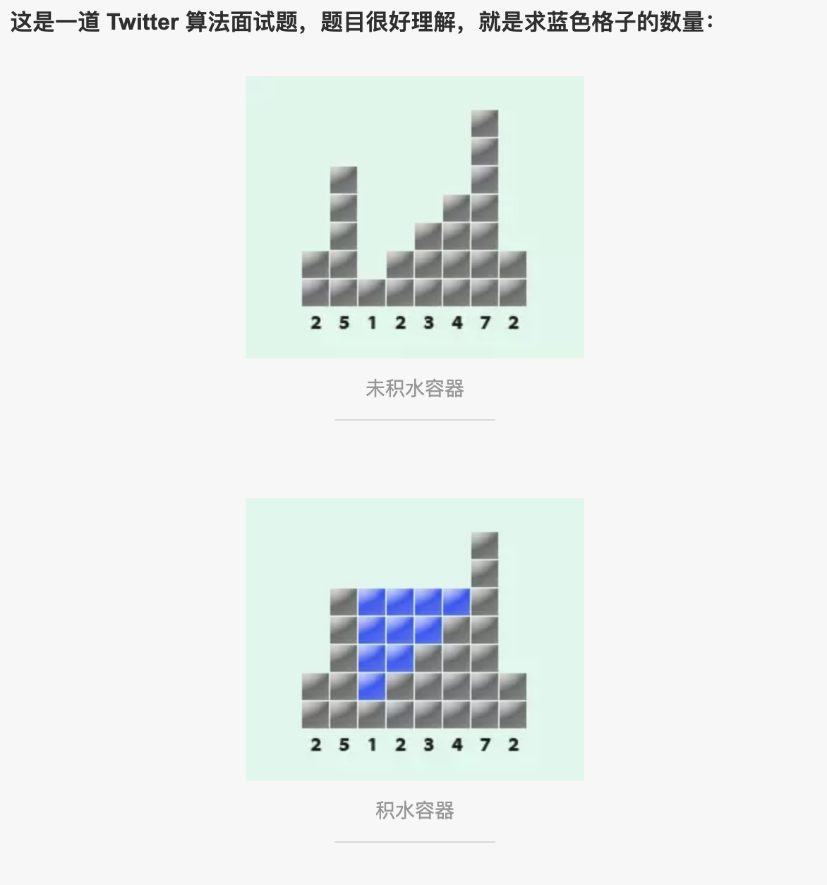

<div class="my_title" style="text-align: center; font-weight: 700; font-size: 2em;">计算不规则容器积水量</div>



```js
function Sediment (array) {
  let total = 0;
  array.forEach((item, index, arr) => {
    let L = ~~Math.max(...arr.slice(0, index)),
      R = ~~Math.max(...arr.slice(index + 1)),
      tag = Math.min(L, R, item);
    if (tag === item) {
      total += Math.min(L, R) - item;
    }
  });
  return total;
}

const arr = [2, 5, 1, 2, 3, 4, 7, 2];
console.log(Sediment(arr)); // 10
```